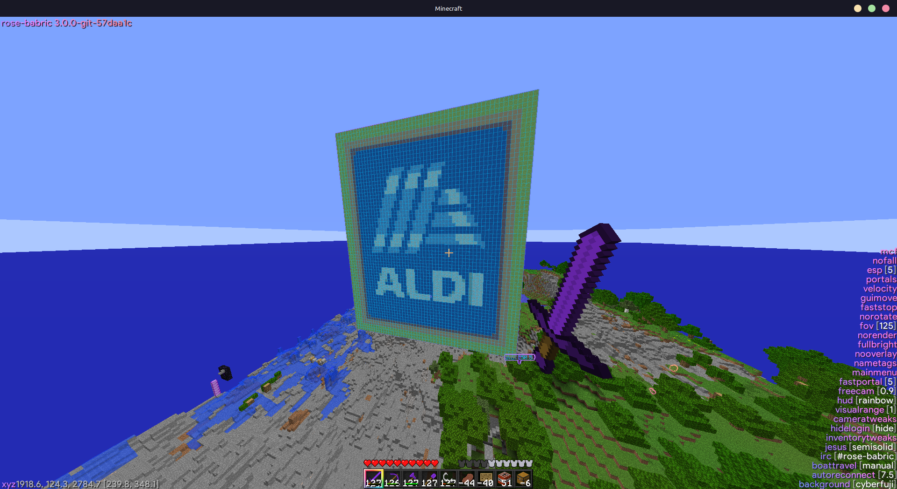

# Brickmatica
A port of backported lunatrius' schematica from ModLoader to Babric.

Screenshot taken on [2beta2t](https://2beta2t.net/)

### Requirements
- [Babric](https://babric.github.io/)
- No StAPI

### Precompiled version
Release builds can be found at [https://github.com/GameHerobrine/Brickmatica/releases](https://github.com/GameHerobrine/Brickmatica/releases).

Latest commit build can be found at [https://nightly.link/GameHerobrine/Brickmatica/workflows/build/master/Artifacts.zip](https://nightly.link/GameHerobrine/Brickmatica/workflows/build/master/Artifacts.zip) (expires after 90 days)
